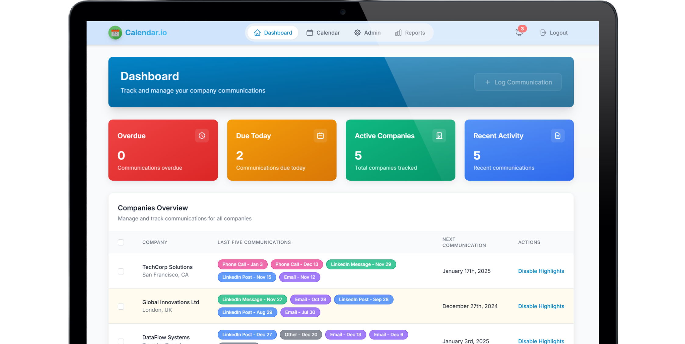

# 📊 Calender.io: Company Communication Tracker

A modern React application for managing and tracking company communications with an intuitive calendar interface and real-time notifications. ✨



## ✅ Features

### 1. Dashboard 📈

- Company overview with communication history
- Real-time status indicators for due and overdue communications
- Last five communications display for each company
- Toggle highlighting for overdue/due communications
- Bulk communication logging for multiple companies

### 2. Calendar View 📅

- Interactive calendar interface using FullCalendar
- Color-coded communication types
- Click-to-schedule functionality
- Visual indicators for communication density

### 3. Communication Management 💬

- Multiple communication types support:
  - LinkedIn Posts
  - LinkedIn Messages
  - Emails
  - Phone Calls
  - Other communications
- Detailed communication logging
- Communication periodicity tracking
- Historical communication records

### 4. Notification System 🔔

- Real-time notifications for:
  - Overdue communications
  - Due today communications
  - Upcoming communications
- Interactive notification panel
- Mark as read functionality
- Notification filtering

### 5. Admin Features ⚙️

- Company management
- Communication method configuration
- User role management
- System settings

## 🛠️ Tech Stack

### Core Technologies 🎯

- **React 18** - UI library
- **TypeScript** - Type safety and better developer experience
- **Vite** - Build tool and development server

### State Management 🔄

- **Redux Toolkit** - Centralized state management
- **React Redux** - React bindings for Redux

### UI Components & Styling 🎨

- **Tailwind CSS** - Utility-first CSS framework
- **Headless UI** - Unstyled, accessible UI components
- **Framer Motion** - Animation library
- **Hero Icons** - SVG icon collection
- **React Loading Skeleton** - Loading state placeholders

### Calendar & Date Handling 📅

- **FullCalendar** - Calendar component
- **date-fns** - Date manipulation library

### Notifications 🔔

- **React Toastify** - Toast notifications

### Charts & Reports 📊

- **Chart.js** - Data visualization
- **React ChartJS 2** - React wrapper for Chart.js

### PDF Generation 📄

- **jsPDF** - PDF document generation
- **html2canvas** - HTML to canvas conversion

## 📁 Project Structure

```
src/
├── components/
│   ├── admin/           # Admin panel components
│   ├── auth/            # Authentication components
│   ├── calendar/        # Calendar view components
│   ├── communications/  # Communication related components
│   ├── common/          # Shared/reusable components
│   ├── dashboard/       # Dashboard components
│   ├── layout/          # Layout components
│   ├── notifications/   # Notification components
│   └── reports/         # Reporting components
├── hooks/               # Custom React hooks
├── store/              # Redux store configuration
│   └── slices/         # Redux slices
├── types/              # TypeScript type definitions
└── utils/              # Utility functions
```

## 🚀 Getting Started

1. Clone the repository:

```bash
git clone https://github.com/vipulkatwal/calender.git
```

2. Install dependencies:

```bash
cd calender
npm install
```

3. Start the development server:

```bash
npm run dev
```

4. Build for production:

```bash
npm run build
```

## 🤝 Contributing

1. Fork the repository 🍴
2. Create your feature branch (`git checkout -b feature/AmazingFeature`)
3. Commit your changes (`git commit -m 'Add some AmazingFeature'`)
4. Push to the branch (`git push origin feature/AmazingFeature`)
5. Open a Pull Request

## 📄 License

This project is licensed under the MIT License - see the [LICENSE](LICENSE) file for details.

## 🙏 Acknowledgments

- [Tailwind CSS](https://tailwindcss.com) 💨
- [FullCalendar](https://fullcalendar.io) 📅
- [Framer Motion](https://www.framer.com/motion) 🎬
- [Redux Toolkit](https://redux-toolkit.js.org) 🔄
